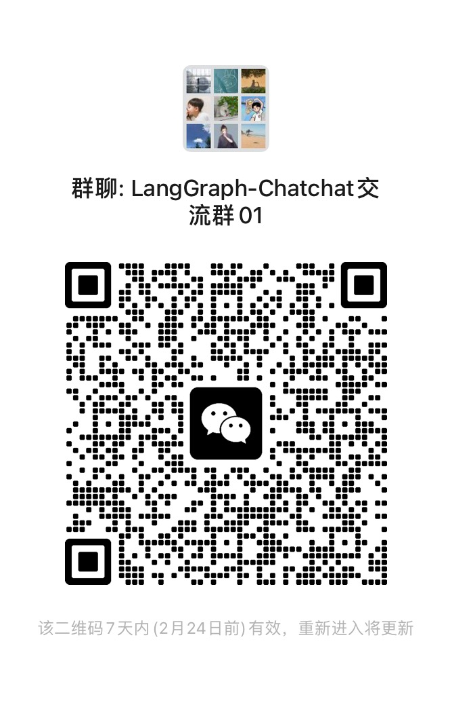

[](https://pypi.org/project/pypiserver/)

📃 **LangGraph-Chatchat**

基于 ChatGLM 等大语言模型与 LangGraph 等应用框架实现，开源、可离线部署的 RAG 与 Agent 应用项目。

---

## 概述

🤖️ 一种利用 [LangGraph](https://langchain-ai.github.io/langgraph/)
思想实现的基于本地知识库的问答应用，目标期望建立一套对中文场景与开源模型支持友好、可离线运行的知识库问答解决方案。

💡 受 [GanymedeNil](https://github.com/GanymedeNil) 的项目 [document.ai](https://github.com/GanymedeNil/document.ai)
和 [AlexZhangji](https://github.com/AlexZhangji)
创建的 [ChatGLM-6B Pull Request](https://github.com/THUDM/ChatGLM-6B/pull/216)
启发，建立了全流程可使用开源模型实现的本地知识库问答应用。本项目的最新版本中可使用 [Xinference](https://github.com/xorbitsai/inference)、[Ollama](https://github.com/ollama/ollama)
等框架接入 [GLM-4-Chat](https://github.com/THUDM/GLM-4)、 [Qwen2-Instruct](https://github.com/QwenLM/Qwen2)、 [Llama3](https://github.com/meta-llama/llama3)
等模型，使用基于 [Streamlit](https://github.com/streamlit/streamlit) 的 WebUI 进行操作。


✅ 本项目支持市面上主流的开源 LLM、 Embedding 模型与向量数据库，可实现全部使用**开源**模型**离线私有部署**。与此同时，本项目也支持
OpenAI GPT API 的调用，并将在后续持续扩充对各类模型及模型 API 的接入。

⛓️ 本项目实现原理如下图所示，过程包括加载文件 -> 读取文本 -> 文本分割 -> 文本向量化 -> 问句向量化 ->
在文本向量中匹配出与问句向量最相似的 `top k`个 -> 匹配出的文本作为上下文和问题一起添加到 `prompt`中 -> 提交给 `LLM`生成回答。

📺 [原理介绍视频](https://www.bilibili.com/video/BV13M4y1e7cN/?share_source=copy_web&vd_source=e6c5aafe684f30fbe41925d61ca6d514)


从文档处理角度来看，实现流程如下：


🚩 本项目未涉及微调、训练过程，但可利用微调或训练对本项目效果进行优化。

🧑‍💻 如果你想对本项目做出贡献，欢迎提交 pr。

## 项目优势与定位

### 项目定位
一款面向`开发者`的`轻量级`的囊括了`RAG`,`Agent`等场景的`LLM`应用`微服务`.

### 与 `LangChain-Chatchat` 的主要联系与自身特色

1. 与 `LangChain-Chatchat` 的联系 
- 开发人员相同, 属于原项目人员新拓展方向
- RAG 检索逻辑不变
- 知识库 功能不变
- 模型和配置架构不变(少量关于 `Agent` 和 `Tool` 的配置有变化) 

ps: 保持这么多的联系的目的: 方便大家在两个项目间平滑切换

2. `LangGraph-Chatchat` 的项目特色
- 背靠 `LangChain` 生态链, `LangGraph` 项目活跃, 有向无环图功能强大, 可供开发者根据不同场景定制各种不同的 `graph` 使用;
- `LangChain` 的 `agent_executor` 过度封装, 可定制性差, 社区目前全力推广 `LangGraph`;
- `LangGraph` 可与 `LangSmith` 搭配使用, 让 `Agent` 开发可视化性更强, 更直观;
- `LangChain-Chatchat` 的历史消息存在前端管理, `LangGraph-Chatchat` 历史消息存在 `sqlite`(默认, 支持异步) 或 `PostgreSQL`(支持连接池+异步) 中, 方便开发者统一管理(UI 管理待支持);
- `LangGraph-Chatchat` 提供了 `graph` 注册器和 `tool` 注册器, 并提供了几种 `demo` 和规范供开发者参考, 开发者可以像组装变形金刚一样开发 `graph`, 并且也都是异步;
- `LangGraph-Chatchat` 对话的全部流程(`agent`和`rag`)均采用 `LangGraph` 来构建, 需要模型具备 `function call` 的能力.
- `LangGraph-Chatchat` 计划只保留一个对话接口, 如: `/chat`, 其他操作全部通过 UI, 如有其他接口需求可随时与开发者讨论. 

## 快速上手

### Docker 安装部署 (一定要看)

查看 [Docker 安装指南](docs/install/README_docker_install.md)

### 源码安装部署/开发部署

查看 [开发部署指南](docs/install/README_dev_install.md)

### 旧版本迁移

- 首先按照 `安装部署` 中的步骤配置运行环境，修改配置文件
- 将 `Langchain-Chatchat` 项目的 `knowledge_base` 目录拷贝到配置的 `DATA` 目录下

---

## 协议

本项目代码遵循 [Apache-2.0](LICENSE) 协议。

## 联系我们

### Telegram

[](https://t.me/+RjliQ3jnJ1YyN2E9)

### 项目交流群



🎉 LangGraph-Chatchat 项目微信交流群，如果你也对本项目感兴趣，欢迎加入群聊参与讨论交流。

## 引用

如果本项目有帮助到您的研究，请引用我们：

```
@software{LangGraph-Chatchat,
    title        = {{LangGraph-Chatchat}},
    author       = {Zhang, Yuehua},
    year         = 2025,
    journal      = {GitHub repository},
    publisher    = {GitHub},
    howpublished = {\url{https://github.com/chatchat-space/LangGraph-Chatchat}}
}
```
