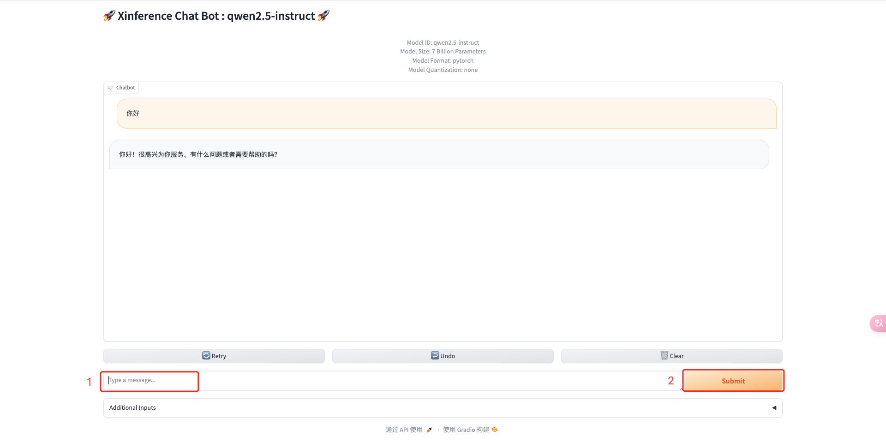
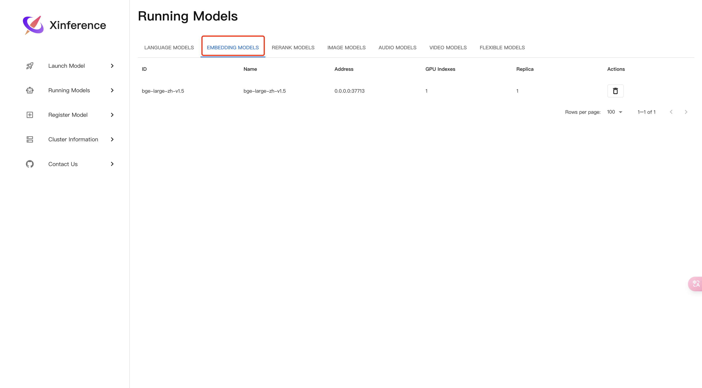
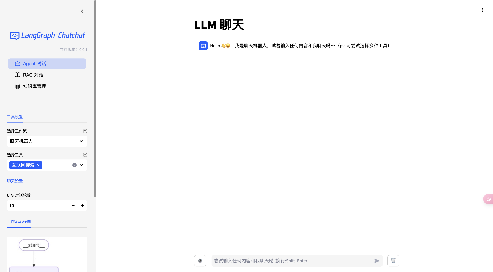

# `LangGraph-Chatchat` 容器化部署指引

> 提示: 此指引为在 `Linux(CentOS)` 环境下编写完成, 其他环境下暂未测试, 理论上可行.
> 
> `LangGraph-Chatchat` `Docker` 镜像已支持 `amd64` 和 `arm64`.
> 
> 本项目默认提供的 `Xinference` `Docker` 镜像只支持 `amd64`.

## 一、安装 `docker` 和 `docker-compose`
- 安装 `docker` 文档参见: [Install Docker Engine](https://docs.docker.com/engine/install/).

- 安装 `docker-compose` 文档参见:
- - [Install Compose standalone](https://docs.docker.com/compose/install/standalone/) 
- - [版本列表](https://github.com/docker/compose/releases)
- - 举例: `Linux` `x86` 环境 可下载 `docker-compose-linux-x86_64` 使用.
```shell
(x) [root@VM-128-14-tencentos ~]$ cd ~
(x) [root@VM-128-14-tencentos ~]$ curl -SL https://github.com/docker/compose/releases/download/v2.30.3/docker-compose-linux-x86_64 -o /usr/local/bin/docker-compose
  % Total    % Received % Xferd  Average Speed   Time    Time     Time  Current
                                 Dload  Upload   Total   Spent    Left  Speed
  0     0    0     0    0     0      0      0 --:--:-- --:--:-- --:--:--     0
100 61.0M  100 61.0M    0     0  12.7M      0  0:00:04  0:00:04 --:--:-- 11.5M
(x) [root@VM-128-14-tencentos ~]$ chmod +x /usr/local/bin/docker-compose
(x) [root@VM-128-14-tencentos ~]$ sudo ln -s /usr/local/bin/docker-compose /usr/bin/docker-compose
(x) [root@VM-128-14-tencentos ~]$ ls -l /usr/bin/docker-compose
lrwxrwxrwx 1 root root 29 Nov 17 19:46 /usr/bin/docker-compose -> /usr/local/bin/docker-compose
(x) [root@VM-128-14-tencentos ~]$ which docker-compose 
/usr/local/bin/docker-compose
(x) [root@VM-128-14-tencentos ~]$ docker-compose -v
Docker Compose version v2.30.3
```

## 二、安装 `NVIDIA Container Toolkit`
寻找适合你环境的 `NVIDIA Container Toolkit` 版本, 文档参见: [Installing the NVIDIA Container Toolkit](https://docs.nvidia.com/datacenter/cloud-native/container-toolkit/latest/install-guide.html)
- `Installation` 必须执行
- `Configuration` 必须执行

## 三、下载 `LangGraph-Chatchat`
```shell
cd ~
git clone https://github.com/chatchat-space/LangGraph-Chatchat.git
cd LangGraph-Chatchat/docker/
tar -xvf chatchat_data.tar.gz -C /root/
cp docker-compose.yaml /root/docker-compose.yaml
```

## 四、配置模型
`LangGraph-Chatchat` 使用本地 `yaml` 文件的方式进行配置, 用户可以直接查看并修改其中的内容.

### 查看目录结构
```shell
[root@VM-1-10-centos chatchat_data]$ ls
basic_settings.yaml  data  kb_settings.yaml  model_settings.yaml  prompt_settings.yaml  tool_settings.yaml
[root@VM-1-10-centos chatchat_data]$ ls -l
total 28
-rw-r--r-- 1 root root 2191 Nov 12 21:21 basic_settings.yaml
drwxr-xr-x 6 root root 4096 Nov 13 01:49 data
-rw-r--r-- 1 root root 3382 Nov 12 21:21 kb_settings.yaml
-rw-r--r-- 1 root root 3879 Nov 13 00:53 model_settings.yaml
-rw-r--r-- 1 root root 5415 Nov 12 21:21 prompt_settings.yaml
-rw-r--r-- 1 root root 3641 Nov 13 00:55 tool_settings.yaml
```

### 数据目录各文件作用解释:
- `data` 项目知识库目录, 储存知识库数据, 体验时不需要修改;
- `basic_settings.yaml` 项目基础配置, 涉及到一些数据目录、数据库地址、项目端口等配置, 体验时不需要修改;
- `kb_settings.yaml` 知识库配置, 体验时不需要修改;
- `model_settings.yaml` 模型配置, 涉及到默认 `LLM` 和 `Embedding Model` 等的配置, 容器启动体验时需要检查 `xinference` 的 `api_base_url` 参数, 将 `api_base_url: http://127.0.0.1:9997/v1` 修改成 `api_base_url: http://xinference:9997/v1`;
```text
修改后如下:
...
MODEL_PLATFORMS:
  - platform_name: xinference
    platform_type: xinference
    api_base_url: http://xinference:9997/v1
    api_key: EMPTY
    ...
```
- `prompt_settings.yaml` 指令配置, 此配置后续可能会有调整, 暂时不需要修改;
- `tool_settings.yaml` 工具配置, 部分工具需要配置 `api key` 等, 体验时不需要修改.

### 其他参数如果需要修改, 可以参考如下:
- 配置模型 `model_settings.yaml`  
  需要根据选用的模型推理框架与加载的模型进行模型接入配置，具体参考 `model_settings.yaml` 中的注释。主要修改以下内容：
  ```yaml
  # 默认选用的 LLM 名称
   DEFAULT_LLM_MODEL: qwen2.5-instruct

   # 默认选用的 Embedding 名称
   DEFAULT_EMBEDDING_MODEL: bge-large-zh-v1.5

  # 将 `LLM_MODEL_CONFIG` 中 `llm_model, action_model` 的键改成对应的 LLM 模型
  # 在 `MODEL_PLATFORMS` 中修改对应模型平台信息
  ```
  
- 配置知识库路径 `basic_settings.yaml`
  默认知识库位于 `CHATCHAT_ROOT/data/knowledge_base`，如果你想把知识库放在不同的位置，或者想连接现有的知识库，可以在这里修改对应目录即可。
  ```yaml
  # 知识库默认存储路径
   KB_ROOT_PATH: D:\chatchat-test\data\knowledge_base

   # 数据库默认存储路径。如果使用sqlite，可以直接修改DB_ROOT_PATH；如果使用其它数据库，请直接修改SQLALCHEMY_DATABASE_URI。
   DB_ROOT_PATH: D:\chatchat-test\data\knowledge_base\info.db

   # 知识库信息数据库连接URI
   SQLALCHEMY_DATABASE_URI: sqlite:///D:\chatchat-test\data\knowledge_base\info.db
  ```
- 配置知识库 `kb_settings.yaml`
  默认使用 `FAISS` 知识库，如果想连接其它类型的知识库，可以修改 `DEFAULT_VS_TYPE` 和 `kbs_config`。

## 五、启动服务
```shell
(x) [root@VM-128-14-tencentos ~]$ cd ~
(x) [root@VM-128-14-tencentos ~]$ docker-compose up -d
WARN[0000] /root/docker-compose.yaml: the attribute `version` is obsolete, it will be ignored, please remove it to avoid potential confusion 
[+] Running 36/36
 ✔ xinference Pulled                                                                                                                4.2s 
   ✔ 43cfb69dbb46 Already exists                                                                                                    0.0s 
   ✔ fbcd35dc5bc3 Already exists                                                                                                    0.0s 
   ✔ c7232af9ae05 Already exists                                                                                                    0.0s 
   ✔ db6cdef1932a Already exists                                                                                                    0.0s 
   ✔ 56dc85502937 Already exists                                                                                                    0.0s 
   ✔ 9f61b3db38d6 Already exists                                                                                                    0.0s 
   ✔ 0bd39d0469a8 Already exists                                                                                                    0.0s 
   ✔ d22ff5f4aac6 Already exists                                                                                                    0.0s 
   ✔ d866993704f5 Already exists                                                                                                    0.0s 
   ✔ b4918d864665 Already exists                                                                                                    0.0s 
   ✔ e93cc01aab8b Already exists                                                                                                    0.0s 
   ✔ fd30840e514d Already exists                                                                                                    0.0s 
   ✔ 2bfc7deab716 Already exists                                                                                                    0.0s 
   ✔ bd6dc6e560f7 Already exists                                                                                                    0.0s 
   ✔ 0064ad513ab3 Already exists                                                                                                    0.0s 
   ✔ eed6f1161030 Already exists                                                                                                    0.0s 
 ✔ chatchat Pulled                                                                                                                 66.1s 
   ✔ b2b31b28ee3c Pull complete                                                                                                     4.0s 
   ✔ c3cc7b6f0473 Pull complete                                                                                                     4.6s 
   ✔ 2112e5e7c3ff Pull complete                                                                                                     6.8s 
   ✔ af247aac0764 Pull complete                                                                                                    13.8s 
   ✔ c7e62dc73b01 Pull complete                                                                                                    14.1s 
   ✔ 35c3ce70330a Pull complete                                                                                                    14.9s 
   ✔ f8af1611cc8d Pull complete                                                                                                    14.9s 
   ✔ 4f4fb700ef54 Pull complete                                                                                                    14.9s 
   ✔ 15ba5fa89d26 Pull complete                                                                                                    14.9s 
   ✔ 171d663ed6b1 Pull complete                                                                                                    20.9s 
   ✔ 610e110dc8b4 Pull complete                                                                                                    21.5s 
   ✔ cbae71cc51a5 Pull complete                                                                                                    22.9s 
   ✔ 8ce54b4ac1ec Pull complete                                                                                                    22.9s 
   ✔ 52e73fdb4aa1 Pull complete                                                                                                    23.0s 
   ✔ 4c44c5875d2a Pull complete                                                                                                    23.8s 
   ✔ 2dbc458f4d0f Pull complete                                                                                                    23.9s 
   ✔ 4a6a450176d2 Pull complete                                                                                                    64.5s 
   ✔ c8e428217519 Pull complete                                                                                                    64.5s 
[+] Running 3/3
 ✔ Network root_default         Created                                                                                             0.1s 
 ✔ Container root-xinference-1  Started                                                                                             0.4s 
 ✔ Container root-chatchat-1    Started                                                                                             0.7s
```
查看服务启动情况
```shell 
(x) [root@VM-128-14-tencentos ~]$ docker-compose ps
WARN[0000] /root/docker-compose.yaml: the attribute `version` is obsolete, it will be ignored, please remove it to avoid potential confusion 
NAME                IMAGE                                                               COMMAND                  SERVICE      CREATED          STATUS          PORTS
root-chatchat-1     ccr.ccs.tencentyun.com/langgraph-chatchat/langgraph-chatchat:1116   "python cli.py start…"   chatchat     47 seconds ago   Up 47 seconds   7861/tcp, 0.0.0.0:80->8501/tcp, [::]:80->8501/tcp
root-xinference-1   chatchatspace/xinference:qwen2.5-2024-1117                          "xinference-local -H…"   xinference   48 seconds ago   Up 47 seconds   0.0.0.0:9997->9997/tcp, :::9997->9997/tcp
```

## 六、启动模型
- 登陆 `Xinference` 容器, 并启动 `LLM` (`qwen2.5-instruct`) 和 `Embedding Model` (`bge-large-zh-v1.5`)
```shell
(x) [root@VM-128-14-tencentos ~]$ docker-compose exec -ti xinference bash
WARN[0000] /root/docker-compose.yaml: the attribute `version` is obsolete, it will be ignored, please remove it to avoid potential confusion 
root@fd17a68b7c33:/opt/inference$ xinference launch --model-engine Transformers --model-name qwen2.5-instruct --size-in-billions 7 --model-format pytorch --quantization none
Launch model name: qwen2.5-instruct with kwargs: {}
Model uid: qwen2.5-instruct
root@fd17a68b7c33:/opt/inference$ xinference launch --model-name bge-large-zh-v1.5 --model-type embedding
Launch model name: bge-large-zh-v1.5 with kwargs: {}
Model uid: bge-large-zh-v1.5
root@fd17a68b7c33:/opt/inference$ exit
exit
```

- 浏览器访问 `http://<你机器的ip>:9997`


- 查看 `qwen2.5-instruct` 启动情况:


- 与 `qwen2.5-instruct` 进行对话:



- 查看 `bge-large-zh-v1.5` 启动情况:



## 七、访问 `LangGraph-Chatchat` 前端

浏览器访问 `http://<你机器的ip>`

出现以下界面即为启动成功:



## 八、查看服务日志
```shell
(x) [root@VM-128-14-tencentos ~]$ docker-compose logs -f chatchat
```
```shell
(x) [root@VM-128-14-tencentos ~]$ docker-compose logs -f xinference
```